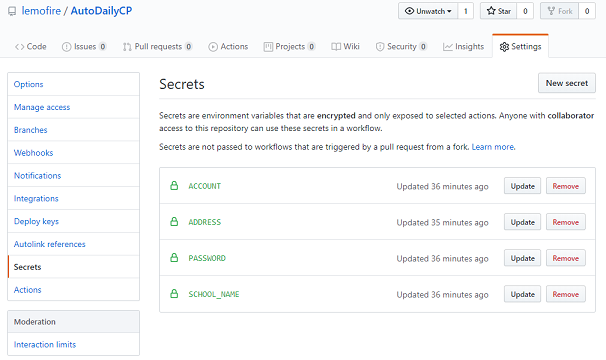
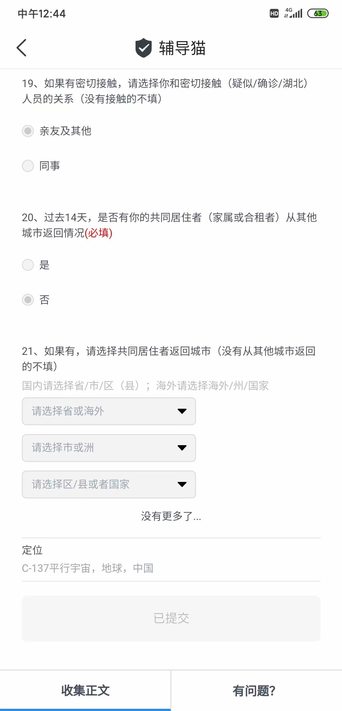

# FuckDailyCP
#### 简介
今日校园自动打卡脚本（不局限于健康打卡，包括收集表，通知确认）。
可以挂服务器上定时自动打卡。
健康的人可以用一下（雾）。

#### 使用说明
理论上支持大部分学校（IAP登录方式，自己先试试能用不）和任意表单内容的自定义。目前已知两种学工号登录方式，均已实现。
运行以下命令即可
```bash
pip install -r requirements.txt
python3 DailyCP.py 学校全名 学号 密码 定位地址 formdb绝对路径
```
#### 关于自定义任意表单内容
因为表单的内容多种多样，也不可能共享给其他人使用，因此本脚本采用“一次编辑，永久使用”的思路。
如果脚本发现未知的表单，会将表单保存到formdb文件夹下，用户必须手动填写好内容，再次运行脚本即可。
关于如何填写，参考example（1129.json）
#### 关于AuthServer的登录方式
目前已知IAP和AuthServer这两种登录方式，IAP是统一的，AuthServer每个学校都不一样。
如果你发现脚本并不能正常运作，请根据输出的信息自行修改代码。
#### 挂服务器提示
请注意系统时间是否设置正确

Linux下可以使用`corntab -e`设置定时任务让程序每天自动打卡
```bash
0 9 * * * python3 DailyCP.py 学校全名 学号 密码 定位地址
```
我已经挂服务器四个月惹，稳的不行。
#### 使用GITHUB ACTIONS自动签到
去GITHUB新建一个仓库，将本项目的.github文件夹上传至你的仓库，点击Settings，增加`SCHOOL_NAME`、`ACCOUNT`、`PASSWORD`、`ADDRESS` 4个Secrets，分别对应你的学校名称、账号、密码、定位地址。<br>


##### ACTIONS运行方式：
* 1.push
* 2.自己给自己star
* 3.每日9点自动运行

第一次使用需要根据Actions的`Run program`中的提示修改`.github/workflows/AutoDailyCP.yml`文件中的`cat>formdb/36.json<<EOF`。<br>
~~当然你也可以使用[旧版](https://github.com/lemofire/DailyCP)就不用修改了~~<br>
栗子：<br>
* 提示：`请手动填写./formdb/41.json，之后重新运行脚本`<br>
* 修改后：`cat>formdb/41.json<<EOF`<br>
每次运行action后会自动打包formdb，可以根据里面的内容修改`cat>formdb/36.json<<EOF`下的代码

#### 效果截图

#### 最后
小老板，给个Star?